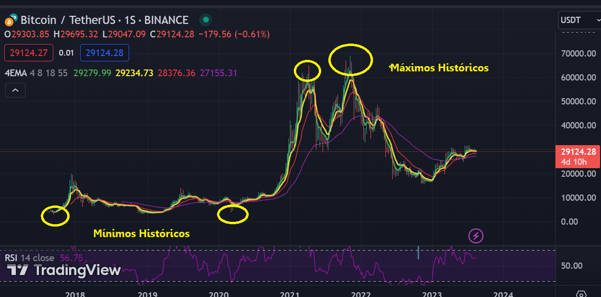

# Proyecto Analytics - Criptomonedas

## Introducción
Este informe tiene como objetivo presentar y analizar en detalle un dashboard interactivo que muestra datos de 10 criptomonedas elegidas en base a algunos indicadores. A través de visualizaciones gráficas y análisis de datos, exploraremos las tendencias, correlaciones y oportunidades potenciales.
A medida que el mercado de las criptos evoluciona y se diversifica, se vuelve cada vez más crucial para los inversores entender el comportamiento y la relación entre diferentes activos digitales.

## Bitcoin: La moneda que marca el camino.

La elección de incluir Bitcoin como parte integral de la cartera se basa en su posición dominante en el mercado,es la cripto más valiosa del mundo, cuenta con una capitalización de mercado de 539,270 millones de dólares.
Otra de las razones es su adopción generalizada. Se ha establecido como la "moneda de referencia" en el ecosistema cripto. Se utiliza como punto de referencia para evaluar el rendimiento de otras monedas digitales. Su presencia en el mercado es significativa, su precio y comportamiento a menudo establecen la dirección para otras criptomonedas.

### Otras Criptos:

- ETHEREUM: a diferencia de BTC, que se concibió principalmente como una moneda digital, Ethereum se desarrolló como una plataforma más versátil que permite a los desarrolladores construir aplicaciones descentralizadas (dApps) y ejecutar contratos inteligentes. La demanda de Ether (cripto nativa de ethereum) va en alza debido a su utilidad en aplicaciones descentralizadas y en el ecosistema DeFi (Finanzas Descentralizadas). Esto nos indica que su valor no solo está vinculado a la especulación, sino también a su función esencial en la red ethereum.

- CARDANO: tiene funcionalidades similares a las de ETHEREUM pero fue justamente creada para solucionar problemas de la red de bitcoin y ethereum, de hecho, es conocida como una de las redes capaces de sustituir a la red de ethereum.Es de código abierto y ofrece una gran escalabilidad y seguridad gracias a la manera en la que está construida.

- POLKADOT: Aunque las criptos mencionadas anteriormente tienen gran escalabilidad, en los últimos años la industria blockchain se está enfrentando con este problema.
Los problemas de escalabilidad se pueden definir como los problemas que presentan las criptos cuando el volumen de usuario crece de forma significativa e implica problemas de rendimiento y operatividad. Polkadot posee una red multifragmentada con la que se pueden procesar muchas transacciones de distintas cadenas en paralelo con el objetivo de acabar con este problema.

- SOLANA: Se trata de una criptomoneda reciente y al igual que en el caso de Polkadot, por sus características se parece más a Ethereum que a Bitcoin.
Sin embargo, una de las principales diferencias entre los proyectos de DOT y SOL es la velocidad de las transacciones. Solana puede soportar hasta 50 000 transacciones por segundo, frente a las 10 000 que puede soportar Polkadot, en el caso del Bitcoin este número se reduce hasta las 7 transacciones por segundo.

- DECENTRALAND: fue creado desarrolladores argentinos. La elección de esta moneda se basa en su papel en la creación del metaverso, su modelo de propiedad y economía virtual.
El metaverso se refiere a un espacio virtual tridimensional en línea donde los usuarios pueden interactuar, socializar, crear y comerciar en un ambiente digital inmersivo. Decentraland permite a los usuarios comprar, desarrollar y poseer terrenos virtuales en su plataforma descentralizada.

- MONERO: es una criptomoneda que está enfocada a ofrecer privacidad a sus usuarios, una diferencia fundamental con competidores como Bitcoin y Ethereum que utilizan Blockchains transparentes.
Actualmente, los reguladores financieros de todo el mundo están buscando formas de regular las criptomonedas, algo que podría beneficiar a Monero, cuyo diseño está concebido para no ser rastreable.

### STABLECOINS (USDT, DAI, USDC).

La decisión de incorporar stablecoins el portfolio, se basa en la búsqueda de estabilidad y diversificación en un mercado caracterizado por la volatilidad.
Están diseñadas para mantener un valor estable en relación con activos subyacentes, como monedas fiduciarias como el USD o el EUR.

- STAKING: el staking de criptos, una práctica donde se bloquan los fondos en una red blockchain para respaldar su operación y seguridad, ofrece oportunidades de ganancias pasivas. Al participar en el staking, se obtienen recompensas en forma de nuevas criptomonedas.
La inclusión de stablecoins y el staking en la cartera pueden contribuir a la estabilidad, diversificación y generación de ingresos pasivos.

## KPI's.

### ROI (Retorno de la Inversión).

El Retorno de la Inversión (ROI) es un KPI fundamental que mide la rentabilidad de la cartera en relación con la inversión inicial. Este indicador permite evaluar cómo las decisiones de inversión están generando ganancias o pérdidas y cómo se comparan con las expectativas.
Para calcular el ROI extraje las cotizaciones diarias desde el año 2018 a 2022 para las criptos más maduras y luego para las de tercera generación (SOL y DOT) usé un rango temporal menor ya que empezaron a cotizar en el mercado en 2020.

### Índice de Volatilidad.

Evalúa la variabilidad de los precios en el portfolio de criptomonedas. La volatilidad puede afectar significativamente el riesgo y oportunidades de ganancias. Al monitorear y gestionar la volatilidad, se pueden identificar activos que pueden tener un impacto desproporcionado en el conjunto de activos y tomar medidas para mitigar riesgos.

La volatilidad se calculó mediante los rendimientos diarios (obtenidos mediante la variación de las cotizaciones diarias) y una desviación estándar trimestral. Luego mediante ajustes obtuve la volatilidad anualizada.

### Índice Sharpe.

Mide la relación entre el rendimiento de los activos y el riesgo asumido. Ayuda a determinar si estamos obteniendo un rendimiento adecuado en comparación con el nivel de riesgo que estamos dispuestos a aceptar. Un Índice Sharpe positivo sugiere que estamos siendo recompensados por el riesgo asumido, mientras que un valor negativo puede indicar la necesidad de ajustes.

### Diversificación de la Cartera.

La Diversificación de Cartera es un KPI esencial para minimizar el riesgo. Evalúa la distribución de los activos en diferentes clases de criptomonedas y proyectos. Al diversificar, evitamos concentrar la inversión en un solo activo y reducimos la exposición a eventos específicos del mercado. Una cartera diversificada puede amortiguar las pérdidas y mejorar la estabilidad a largo plazo.
Para esto clasifiqué en tres perfiles de inversión (Conservador, Moderado y Agresivo)y cómo tenía que ser la composición según estos.

### Dashboard.

En el dashboard incluí un análisis de tendencia del precio de BTC en 5 años. Ya que supongo que el horizonte temporal en el que se quiere invertir podría ser a 5 años.

Incluí un panel además donde se muestran los Máximos y Mínimos históricos de cada activo.

La incorporación de datos sobre mínimos y máximos históricos en el dashboard de inversión proporciona una visión más completa y contextualizada de la evolución de los activos en el tiempo. Porque quizás exista un rendimiento muy negativo de parte de un activo y pensemos que no es bueno invertir ahí, pero si encontramos que estamos cerca de un mínimo histórico seguramente sea una buena oportunidad debido a que los activos siempre tienden a respetar ciclos económicos.

La observación de ganancias en un año (2021) y pérdidas en otro (2022) destaca la importancia fundamental de la diversificación de los criptoactivos.
Los activos altamente volátiles pueden verse equilibrados por otros más estables (stablecoins), contribuyendo a mantener un equilibrio general y a reducir la exposición a la volatilidad extrema.
Justamente por la importancia de la diversificación, se muestra la composición de los activos de acuerdo a los distintos perfiles que se pueden tomar. 

El objetivo es lograr un equilibrio entre la estabilidad y el crecimiento a largo plazo. La inclusión de stablecoins y la práctica del staking pueden seguir siendo componentes valiosos para mantener la estabilidad mientras se buscan oportunidades de ganancias pasivas.
Si la empresa estuviera establecida en Argentina también se justifica la compra de Stablecoins ya que tienen capacidad para brindar una protección en el contexto económico de Argentina. La volatilidad del tipo de cambio y la inflación son factores significativos que impactan en las inversiones y ganancias en este entorno, y las stablecoins ofrecen una solución efectiva para mitigar estos riesgos.

## LINKS:

[EDA](EDA.ipynb)

[IMPORTACION](IMPORTACION.ipynb)

